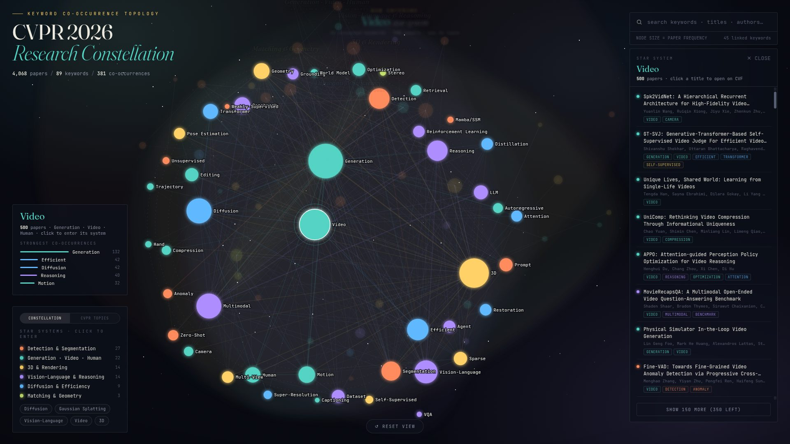

# CVPR 2026 · Research Constellation

An interactive keyword co-occurrence map of all **4,068 accepted papers at CVPR 2026**, rendered as a navigable "star map" — keywords are stars, co-occurrences are the threads between them, and research communities form star systems.

**Live demo → https://cvpr-constellation.github.io/**



## Features

- **Constellation view** — 89 keywords sized by paper frequency, force-laid-out into 6 co-occurrence communities (Louvain), each with a name plate and a soft hull
- **CVPR Topics view** — toggle to re-group the same topology by the official CVPR call-for-papers topics (27 topics, every keyword mapped)
- **Star-system mode** — click any keyword to fly into its system: the keyword becomes the central star and its co-occurring keywords arrange into orbits (stronger link = closer orbit)
- **Unified search** — one box matches keywords, paper titles **and authors**; an exact keyword query flies straight into its system
- **Paper drawer** — every paper row shows title, full author list and keyword chips; hovering a row pings that paper's keywords on the map; titles link to CVF Open Access
- **Hierarchical navigation** — drilling system-to-system builds a clickable breadcrumb (`all › Video › Grounding`); the parent system is pinned at 12 o'clock with a dashed ring
- **Presentation filter** — 📢 oral / 🔥 highlight / 🏆 award checkboxes re-weigh the whole topology and all paper lists
- **Findings galaxy** — the 941 CVPR 2026 Findings papers as their own re-weighted sky
- **Workshops galaxies** — all 150 CVPR 2026 workshops grouped by the official site's categories; stars with published proceedings list their papers, the rest link to the workshop page
- **Light/dark theme** — ivory light theme with a toggle; defaults to the system color scheme
- **Visitor stats** — cumulative visitors, ~live viewers, top regions and a mini world map (serverless: [Abacus](https://abacus.jasoncameron.dev) counters + [ipapi.co](https://ipapi.co))
- **Mobile-friendly** — responsive layout with a bottom-sheet paper list and a lite rendering tier (no SVG filters) for phones/tablets

Everything is a single static `index.html` + two JSON files. No build step, no backend.

## Run it yourself

Any static file server works:

```bash
python3 -m http.server          # then open http://localhost:8000
```

Or fork this repo and enable GitHub Pages.

## Rebuild the data (e.g. for another conference/year)

1. Save the CVF Open Access listing, e.g. `https://openaccess.thecvf.com/CVPR2026?day=all` → `cvpr_oa.html`
2. ```bash
   pip install networkx
   python scripts/build_graph.py cvpr_oa.html --venue "CVPR 2026"
   ```
3. This regenerates `graph.json` and `papers.json`. If the keyword set changes, adjust the community names (`COMM`) and the CVPR-topic mapping (`TOPIC_OF`) near the top of the script section in `index.html`.

`papers.json` format: one compact record per paper — `[title, cvf_stub, [keyword_indices], community, "Author A, Author B, …"]`.

## Tech

[D3 v7](https://d3js.org) force simulation, vanilla JS, Fraunces + JetBrains Mono. Paper data scraped from [CVF Open Access](https://openaccess.thecvf.com).

## Credits, data & license

This is an **unofficial visualization** of publicly available CVPR 2026 paper metadata. It is not affiliated with or endorsed by CVPR, CVF, IEEE, or the IEEE Computer Society.

The site stores only bibliographic metadata (titles, author names, links); no abstracts or PDFs are hosted — every paper links to its official [CVF Open Access](https://openaccess.thecvf.com) page. Paper metadata © the Computer Vision Foundation. arXiv links via [paperswithcode.co](https://paperswithcode.co); world map from Natural Earth (public domain).

Visitor stats are privacy-friendly: anonymous, aggregate, country-level counts only — no cookies, no IPs stored.

Built by [Deokhyun Ahn](https://deo-ahn.github.io) ([@Deo-ahn](https://github.com/Deo-ahn)).

Code is [MIT](LICENSE) — use it freely.
